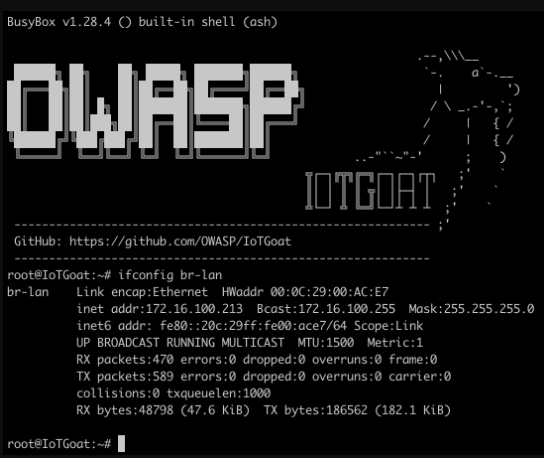

# OWASP_IOTgoat_build_for_A5-V11_mini_3G_router

This repo has been made in regard to an issue with the OWASP IOTgoat project

https://github.com/OWASP/IoTGoat

The IoTGoat Project is a deliberately insecure firmware based on OpenWrt and maintained by OWASP as a platform to educate software developers and security professionals with testing commonly found vulnerabilities in IoT devices.

The IOTgoat project offer some pre-made binaries for Raspberry Pi 2 and X86 machines. Additionally, a VMDK image to use with VMware/VBox and virtualization with Qemu.

However, Internet Of Things (IOT) devices are non-standard computing "hardware". 
IOT devices in essence are gadgets that connect wirelessly to a network and can transmit data. IOT devices most times are small and inexpensive.
Therefore, is not a better experience to learn about IOT exploitation than running 'the vulnearable IOTgoat firmware' in a real IOT device.
-

Enter the A5-V11 mini router 
https://openwrt.org/toh/unbranded/a5-v11

This mini router has a small size (62 mm x 24 mm x 14.5 mm) and a low price tag (in 2023, cost around $8 US on aliexpress).

It is certainly one of the smallest and cheapest routers onto which you can install OpenWrt (Linux for embedded devices).

All in all, this device needs to be upgraded/modded to work for our purposes.

# Project requirements:

1.-We'll upgrade the mini router SPI eeprom capacity to 16MB with the chip "W25Q128". It can be found for a couple of bucks on aliexpress

https://www.aliexpress.us/item/3256804269088009.html

2.- The programer flasher ch341a with a clip adapter, which is very inexpensive and its supported for the awesome tool flashroom.

https://www.ebay.com/itm/285027193020

3.-An iron and solder

4.-A PC running linux

# Device preparation process:

1.- First, we need to create a blank canvas (named '16MBpadded.bin') of 16MB for the new flash chip. running the following command:

dd if=/dev/zero bs=1M count=16 of=16MBpadded.bin

2.- We will need a new Uboot for our Mini router. (Thanks to Wert-Wert)

Get it from this site https://disk.yandex.com/d/ubSsjNZU34Xk2L

Choose the file/image called 'Uboot_usb_256_03.img'

3.- Merge the new Uboot with the blank canvas

dd if=Uboot_usb_256_03.img conv=notrunc of=16MBpadded.bin

4.- Now, the image containing a new Uboot is ready, let's flash it to the W25Q128 (16MB).

So, grab the "W25Q128" chip you bought.

Connect it to the ch341a Programmer's Clip and flash the file with the following command:

sudo flashrom -p ch341a_spi -c "your-flash-chip-name/number-detected-by-flashrom" -w 16MBpadded.bin

Note: in my case the flash name/number was 'GD25Q64(B)'. your could be different.

5.- Solder the "W25Q128" chip to the mini router.

remove the original SPI flash chip from the Mini router and solder the "W25Q128" chip in its place.

# Steps to install the IOTgoat binary to the A5-V11 mini 3G router

1.- Get a USB flash drive formated to FAT32.

2.- Get the Custom IOTgoat pre-made image from the release section of this page.

3.- Then place the pre-made image on the root directory of the USB flash drive.

4.- Connect the USB to your device.

While holding the reset button, power the A5-V11 device. (keep holding the reset button for 10 seconds, the release the button). 
Your USB flash drive will light up and the OpenWRT custom image will be installed/flashed. 
Leave your device alone, wait a minute. Now, your IOTgoat is ready to be hacked.

5.- Head to the challenges section of OWASP/IOTgoat and start hacking this little device.

https://github.com/OWASP/IoTGoat/wiki/IoTGoat-challenges

remember for all the exercises always have in mind the OWASP Firmware Security Testing Methodology

https://scriptingxss.gitbook.io/firmware-security-testing-methodology

6.-  Drink beer!
          

